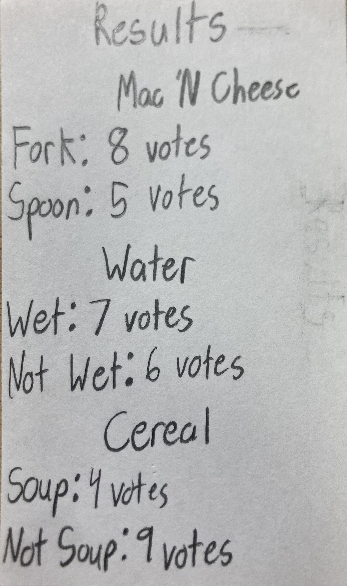
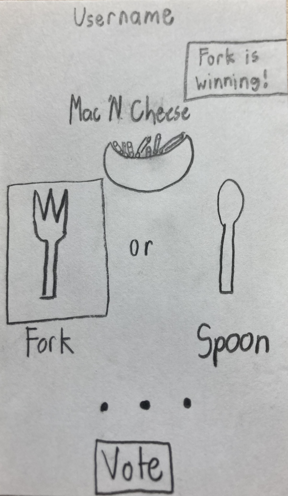
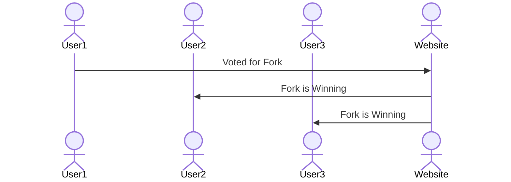

# Controversy Solver

[My Notes](notes.md)

A brief description of the application here.

> [!NOTE]
>  This is a template for your startup application. You must modify this `README.md` file for each phase of your development. You only need to fill in the section for each deliverable when that deliverable is submitted in Canvas. Without completing the section for a deliverable, the TA will not know what to look for when grading your submission. Feel free to add additional information to each deliverable description, but make sure you at least have the list of rubric items and a description of what you did for each item.

## 🚀 Specification Deliverable

> [!NOTE]
>  Fill in this sections as the submission artifact for this deliverable. You can refer to this [example](https://github.com/webprogramming260/startup-example/blob/main/README.md) for inspiration.

For this deliverable I did the following. I checked the box `[x]` and added a description for things I completed.

- [x] Proper use of Markdown
- [x] A concise and compelling elevator pitch
- [x] Description of key features
- [x] Description of how you will use each technology
- [x] One or more rough sketches of your application. Images must be embedded in this file using Markdown image references.

### Elevator pitch

How many times have you argued with your friends over simple controversial subjects, such as whether water is wet, cereal is a soup, or what utensil you eat macaroni and cheese with? This website can finally settle some of the most controversial debates through a simple voting system. Whichever choice receives the most votes determines what option is truly correct. The website even lets you see how popular each option is among other people, and will notify you when a winner has changed.

### Design

Here is how people would interact with the website. In this case, User1 tipped the scale of votes and now the option 'Fork' is winning.

### Key features

- Prevents votes until signed in
- Shows total vote count for each option after submitting votes
- Displays images for each option
- Only allows one vote per user
- Votes stay permantly 
- Displays winning option when winner changes
- Highlights winning option after submitting votes

### Technologies

I am going to use the required technologies in the following ways.

- **HTML** - Uses two pages, one fpr voting and one for displaying the results.
- **CSS** - Text for options is centered under each image, looks nice, and is easy to read. Easy to determine which option is winning on results page.
- **React** - Redirects user to results page when votes are submittied via a button press.
- **Service** - Uses authentication API to verify user is logged in and hasn't already voted
- **DB/Login** - Displays the amount of votes made for each option o nthe results page.
- **WebSocket** - Notifies user if a new option receives more votes than current winner.

## 🚀 AWS deliverable

For this deliverable I did the following. I checked the box `[x]` and added a description for things I completed.

- [x] **Server deployed and accessible with custom domain name** - [My server link](https://controversysolver.click).

## 🚀 HTML deliverable

For this deliverable I did the following. I checked the box `[x]` and added a description for things I completed.

- [x] **HTML pages** - there are 3 HTML pages: One for the Login, one for Voting, and one for viewing the Results.
- [x] **Proper HTML element usage** - Each page has a Header and Footer.
- [x] **Links** - The login buttons and the temporary navigation section links to the other pages.
- [x] **Text** - There is text for each of the options and titles of questions.
- [x] **3rd party API placeholder** - The Results page will have a cool programming quote on it.
- [x] **Images** - Each question has an image representing the controversy below it.
- [x] **Login placeholder** - The Login has a place to enter a user's netID and password.
- [x] **DB data placeholder** - The Results page has the placeholder for the votes for each option.
- [x] **WebSocket placeholder** - The Results page has the placeholder for updating the user when there is an upset/tie in votes.

## 🚀 CSS deliverable

For this deliverable I did the following. I checked the box `[x]` and added a description for things I completed.

- [x] **Header, footer, and main content body** - I added consistent background colors and headers/footers
- [x] **Navigation elements** - The navigation link are in the header at the top of every page
- [x] **Responsive to window resizing** - I added code to resize different things
- [x] **Application elements** - I added padding and margin space between each section/question, and I centered the options for each question.
- [x] **Application text content** - I resized each question and alligned them with their respective image
- [x] **Application images** - I centered and added borders for each image.

## 🚀 React part 1: Routing deliverable

For this deliverable I did the following. I checked the box `[x]` and added a description for things I completed.

- [x] **Bundled using Vite** - Done!
- [x] **Components** - Done! And edited my css components, as well as made a general css page.
- [x] **Router** - Routes between login and voting, and results components.

## 🚀 React part 2: Reactivity

For this deliverable I did the following. I checked the box `[x]` and added a description for things I completed.

- [x] **All functionality implemented or mocked out** - Websocket and thid party API are mocked out
- [x] **Hooks** - I use several hooks throughout my jsx

## 🚀 Service deliverable

For this deliverable I did the following. I checked the box `[x]` and added a description for things I completed.

- [x] **Node.js/Express HTTP service** - Check
- [x] **Static middleware for frontend** - I use middleware to check if a user is verified to call an endpoint.
- [x] **Calls to third party endpoints** - My frontend gets quotes and an author from a third party endpoint.
- [x] **Backend service endpoints** - I have backend endpoints for creating/logging in/out a user, getting a user, and getting/updating the total votes for each option.
- [x] **Frontend calls service endpoints** - My frontend calls my service endpoints when a user logs in/out and when the votes are submitted.
- [x] **Supports registration, login, logout, and restricted endpoint** - Endpoints are restricted if a user is not verified, and the rest are explained above.

## 🚀 DB/Login deliverable

For this deliverable I did the following. I checked the box `[x]` and added a description for things I completed.

- [ ] **Stores data in MongoDB** - I did not complete this part of the deliverable.
- [ ] **Stores credentials in MongoDB** - I did not complete this part of the deliverable.

## 🚀 WebSocket deliverable

For this deliverable I did the following. I checked the box `[x]` and added a description for things I completed.

- [ ] **Backend listens for WebSocket connection** - I did not complete this part of the deliverable.
- [ ] **Frontend makes WebSocket connection** - I did not complete this part of the deliverable.
- [ ] **Data sent over WebSocket connection** - I did not complete this part of the deliverable.
- [ ] **WebSocket data displayed** - I did not complete this part of the deliverable.
- [ ] **Application is fully functional** - I did not complete this part of the deliverable.
